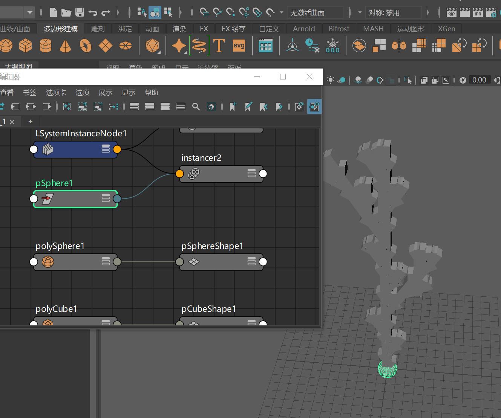
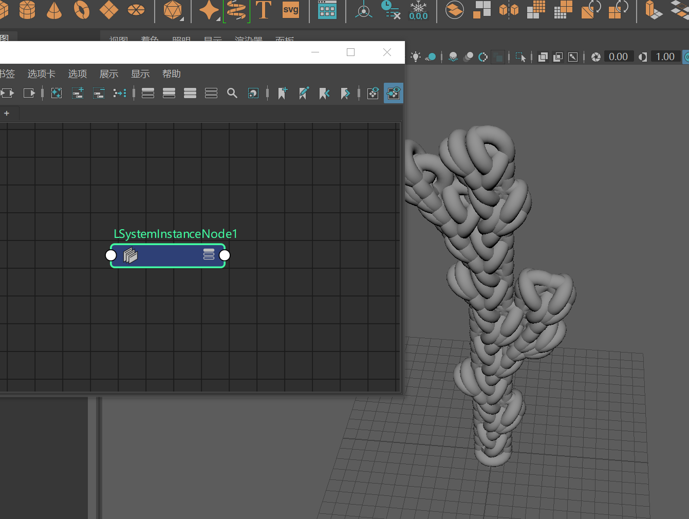

# Maya-Plugin-LSystem

**The goals of this project are to learn the basics of using SWIG to access C++ functionality
from within Python, to gain familiarity with developing Maya plug-ins with Python, and to gain
more experience with Maya’s Dependency Graph and node networks.**

# Result

## Create the L-System Instancer Node:

## Updating the L-System:

